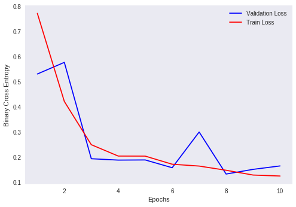
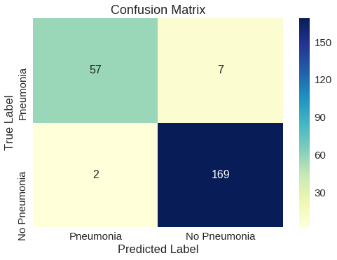

<h1> <center> Pneumonia Detection </center></h1>

## Data Source -:https://www.kaggle.com/parthachakraborty/pneumonia-chest-x-ray


```python
import matplotlib.pyplot as plt
import seaborn as sns
import numpy as np
import pandas as pd
import os
import pickle

import tensorflow as tf
from sklearn.metrics import confusion_matrix
from keras.preprocessing import image
from keras import models
from keras import layers
from keras import optimizers

from keras import applications
from keras.optimizers import Adam
from keras.models import Sequential, Model 
from keras.layers import Dropout, Flatten, Dense, GlobalAveragePooling2D,Conv2D,MaxPooling2D,BatchNormalization
from keras import backend as k 
from keras.callbacks import ModelCheckpoint, LearningRateScheduler, TensorBoard, EarlyStopping

import keras
from keras.optimizers import SGD
from sklearn.model_selection import train_test_split
```

    Using TensorFlow backend.
    


```python
df=pd.read_csv('/content/drive/My Drive/Pneumonia/All/GTruth.csv')
df.head()
```


<div>
<style scoped>
    .dataframe tbody tr th:only-of-type {
        vertical-align: middle;
    }

    .dataframe tbody tr th {
        vertical-align: top;
    }

    .dataframe thead th {
        text-align: right;
    }
</style>
<table border="1" class="dataframe">
  <thead>
    <tr style="text-align: right;">
      <th></th>
      <th>Id</th>
      <th>Ground_Truth</th>
    </tr>
  </thead>
  <tbody>
    <tr>
      <th>0</th>
      <td>643781546</td>
      <td>1</td>
    </tr>
    <tr>
      <th>1</th>
      <td>540270208</td>
      <td>0</td>
    </tr>
    <tr>
      <th>2</th>
      <td>585452583</td>
      <td>1</td>
    </tr>
    <tr>
      <th>3</th>
      <td>341665171</td>
      <td>0</td>
    </tr>
    <tr>
      <th>4</th>
      <td>940983956</td>
      <td>1</td>
    </tr>
  </tbody>
</table>
</div>


```python
df['Ground_Truth'].value_counts()
```


    1    4273
    0    1583
    Name: Ground_Truth, dtype: int64


```python
kv_dict= dict(zip(df['Id'].values,df['Ground_Truth'].values))
kv_dict
```


    {643781546: 1,
     540270208: 0,
     585452583: 1,
     341665171: 0,
     940983956: 1,
     351876904: 0,
     833529062: 0,
     65354019: 1,
     864873088: 1,
     261031442: 0,
     391277389: 0,
     749354161: 1,
     269118795: 0,
     38909281: 1,
     255411092: 1,
     693759901: 0,
     221912234: 1,
     200725658: 1,
     794538028: 1,
     605689867: 0,
     422941988: 1,
     485016781: 0,
     336196931: 1,
     154471781: 1,
     83351054: 0,
     355920256: 0,
     427807999: 1,
     774938683: 1,
     345755509: 0,
     204292657: 1,
     313025667: 0,
     234259238: 1,
     21335482: 0,
     599260779: 1,
     785725781: 1,
     29100641: 1,
     62322510: 0,
     126945057: 0,
     12300583: 1,
     603627132: 0,
     371015170: 0,
     125920418: 1,
     821093472: 1,
     211188056: 1,
     123464343: 0,
     697457186: 0,
     131206546: 1,
     283488682: 0,
     300543131: 1,
     323623474: 0,
     926674154: 1,
     95371153: 0,
     878645698: 1,
     492690172: 0,
     729554598: 1,
     17947132: 1,
     136754357: 0,
     940444465: 1,
     547551082: 0,
     945052599: 1,
     211431234: 1,
     904098070: 1,
     647732844: 1,
     686659192: 1,
     622207917: 0,
     586776405: 1,
     562213608: 1,
     609181920: 1,
     60739909: 0,
     565383391: 1,
     468314726: 1,
     834050714: 0,
     18569318: 1,
     629541119: 1,
     13408273: 1,
     915167855: 1,
     600367233: 1,
     475524082: 1,
     26084936: 1,
     806141301: 1,
     999946824: 1,
     277740721: 0,
     912823436: 1,
     379223351: 1,
     761454340: 1,
     834863765: 1,
     717871905: 1,
     780191780: 0,
     521035378: 1,
     526385601: 1,
     501786712: 1,
     912169344: 1,
     601691554: 0,
     831056715: 0,
     728152794: 1,
     307244490: 0,
     919408574: 1,
     741761429: 0,
     458494335: 1,
     814148345: 0,
     842226782: 1,
     677279569: 1,
     453154255: 0,
     234499949: 1,
     327730062: 0,
     416559661: 0,
     635734916: 1,
     427037265: 0,
     142372532: 1,
     951694525: 0,
     792646799: 0,
     593932537: 0,
     900572458: 0,
     977204337: 1,
     105951441: 1,
     515773885: 0,
     96138665: 0,
     551231399: 1,
     694906473: 1,
     222701718: 0,
     899280177: 1,
     280724047: 0,
     442654674: 0,
     403990477: 1,
     7424572: 0,
     414052313: 0,
     491256447: 0,
     41307478: 1,
     236870491: 1,
     49729343: 0,
     654663646: 1,
     266957139: 1,
     536571816: 0,
     410550404: 0,
     591494383: 1,
     264853596: 0,
     915459031: 1,
     702527128: 1,
     57036608: 0,
     992118034: 0,
     175016146: 0,
     738764216: 0,
     727147670: 1,
     896927064: 1,
     194179976: 0,
     949087410: 0,
     508040288: 0,
     182785946: 1,
     702126226: 0,
     154976710: 0,
     226229839: 1,
     570116504: 1,
     202671645: 1,
     759600165: 1,
     93500685: 0,
     492858352: 1,
     565684077: 1,
     940471363: 0,
     963889472: 1,
     67055948: 0,
     764512092: 1,
     433185507: 1,
     355980149: 1,
     907548301: 1,
     751460236: 1,
     464742639: 0,
     134686863: 0,
     173228195: 1,
     464889149: 1,
     766075381: 1,
     482627940: 1,
     672289783: 1,
     944362386: 1,
     596364873: 1,
     501002871: 0,
     632389242: 0,
     410265809: 0,
     46680770: 1,
     346147070: 1,
     640629070: 0,
     458328569: 0,
     426874340: 0,
     836736674: 1,
     700013405: 0,
     183751460: 1,
     583549926: 1,
     245380409: 0,
     884056950: 1,
     504721513: 1,
     192282003: 1,
     242085472: 0,
     493845819: 1,
     22768989: 1,
     475661332: 0,
     89330110: 1,
     141932457: 1,
     492282837: 0,
     147192672: 1,
     640687663: 1,
     779648772: 1,
     169853650: 1,
     490999242: 0,
     50947408: 1,
     765430339: 1,
     493675991: 1,
     415414256: 0,
     348774806: 0,
     944722864: 0,
     717601177: 1,
     465998948: 1,
     833225380: 0,
     669053569: 1,
     207775982: 1,
     672248112: 1,
     500023361: 0,
     560480543: 0,
     941505823: 0,
     204883396: 1,
     515003019: 1,
     165412074: 0,
     918600232: 1,
     767463768: 1,
     266976041: 1,
     48945966: 0,
     403910063: 1,
     664512358: 1,
     918505850: 1,
     392327826: 1,
     673713322: 1,
     203393490: 1,
     171059693: 1,
     256709489: 1,
     959174538: 1,
     890889797: 1,
     167701146: 1,
     440051107: 0,
     558214723: 1,
     944596195: 1,
     153894659: 1,
     102760370: 0,
     466424836: 1,
     717330260: 1,
     795487933: 1,
     161472778: 0,
     110487776: 1,
     514431295: 1,
     450347650: 1,
     377022965: 0,
     637721758: 0,
     485807849: 1,
     312186457: 1,
     897853965: 1,
     223278205: 0,
     415568358: 1,
     257515346: 1,
     312894208: 0,
     933596489: 1,
     142579990: 1,
     671615702: 0,
     948246753: 1,
     114421779: 1,
     897079795: 0,
     216259842: 1,
     453879248: 0,
     704784293: 0,
     749909382: 1,
     537537653: 1,
     670887754: 0,
     544153578: 1,
     106943481: 1,
     213965215: 0,
     829040434: 1,
     10813531: 1,
     965800447: 0,
     743580805: 0,
     422889230: 1,
     289646369: 0,
     256290444: 1,
     348967929: 0,
     721644662: 0,
     594426837: 1,
     231348702: 1,
     369969029: 1,
     312434204: 1,
     220716664: 1,
     359666041: 1,
     132685310: 0,
     359851015: 0,
     671769956: 1,
     342230444: 1,
     215621723: 1,
     652566465: 1,
     939825896: 1,
     72486530: 1,
     585120122: 1,
     921048949: 1,
     724094252: 0,
     53764010: 0,
     706008211: 1,
     891783581: 1,
     676896360: 1,
     673745597: 1,
     37324933: 0,
     190016495: 1,
     689252121: 1,
     104267384: 1,
     645531423: 0,
     285184966: 1,
     569638686: 0,
     793004024: 1,
     967159687: 0,
     775865578: 1,
     650053984: 1,
     401218612: 0,
     174650700: 0,
     367221724: 1,
     85955911: 1,
     172859972: 0,
     875194541: 1,
     978888264: 1,
     169593048: 1,
     423728711: 1,
     883775442: 1,
     525597300: 0,
     215089054: 1,
     375708319: 1,
     981521725: 0,
     596834307: 0,
     658248453: 0,
     365227338: 0,
     574878310: 1,
     1029321: 1,
     499437818: 0,
     681681746: 1,
     294996019: 1,
     655129279: 0,
     159191806: 1,
     622433326: 1,
     12826799: 1,
     691258670: 1,
     727936729: 0,
     633265838: 0,
     982803189: 1,
     346469135: 0,
     770584494: 1,
     423651937: 0,
     367045794: 0,
     186643832: 1,
     454541234: 0,
     939559643: 1,
     778125078: 1,
     536911848: 1,
     188819794: 0,
     972018443: 0,
     909064045: 1,
     505338846: 1,
     933796474: 1,
     24211489: 0,
     560298810: 0,
     351889420: 1,
     855140654: 1,
     674666723: 1,
     359278610: 1,
     434700075: 1,
     15916060: 1,
     523770728: 0,
     363662378: 1,
     768812660: 0,
     929084081: 1,
     232386212: 0,
     957612712: 1,
     747144786: 1,
     598742888: 1,
     961019974: 0,
     788109802: 1,
     247501617: 1,
     649981134: 1,
     457102971: 1,
     758516340: 1,
     211747289: 0,
     825521414: 1,
     481153104: 1,
     24797113: 1,
     276089429: 1,
     996486748: 1,
     198834920: 1,
     214511298: 1,
     195211060: 0,
     970157993: 1,
     372968040: 0,
     826076450: 0,
     953723040: 1,
     103933642: 1,
     751582230: 1,
     969109509: 1,
     126038764: 1,
     67174422: 0,
     339023843: 1,
     116819550: 1,
     504086550: 1,
     837123002: 1,
     164755726: 1,
     813390258: 0,
     564233064: 1,
     304757080: 1,
     901004921: 0,
     630367501: 1,
     564072343: 1,
     805657313: 0,
     294127602: 0,
     344573502: 0,
     825613850: 0,
     832949308: 0,
     33811559: 0,
     753419531: 1,
     981835480: 1,
     488307859: 1,
     50913005: 1,
     193984727: 1,
     890198183: 1,
     31515252: 0,
     940097152: 1,
     347600612: 1,
     770186962: 1,
     352184277: 0,
     258596552: 1,
     145579305: 1,
     618655046: 1,
     453256411: 0,
     901900641: 0,
     808964321: 0,
     714128592: 1,
     828448528: 0,
     1705822: 0,
     416431662: 0,
     633790228: 0,
     912763770: 1,
     790066248: 1,
     841200912: 1,
     911060965: 1,
     655406729: 1,
     296432575: 1,
     869940156: 0,
     808750848: 1,
     648577333: 1,
     690586488: 1,
     744870712: 1,
     146082600: 0,
     106143257: 0,
     6895686: 0,
     400708030: 1,
     840142214: 1,
     341932697: 1,
     268317967: 1,
     270873854: 1,
     374726940: 0,
     422732494: 1,
     225349818: 0,
     696719340: 0,
     659802573: 0,
     491322295: 1,
     206828584: 1,
     769252898: 0,
     947306060: 0,
     437393350: 1,
     36682602: 1,
     600676826: 0,
     261343827: 1,
     972346996: 0,
     728257725: 1,
     564478773: 1,
     943275810: 0,
     928759230: 1,
     706929706: 1,
     454440593: 1,
     597344657: 1,
     133645256: 1,
     199047440: 0,
     307529494: 0,
     503144725: 1,
     334770924: 1,
     331556292: 1,
     226572611: 0,
     887606962: 1,
     287012194: 1,
     173025799: 1,
     277525930: 1,
     299070876: 1,
     207166574: 0,
     937015434: 0,
     892318009: 1,
     973048465: 0,
     686817530: 1,
     742107897: 1,
     845632545: 1,
     867120029: 1,
     977282815: 1,
     17811736: 1,
     61820901: 0,
     336928042: 1,
     132781312: 0,
     413155967: 0,
     475330792: 1,
     975077669: 1,
     502067817: 0,
     382394871: 1,
     39568474: 0,
     204994304: 1,
     328216837: 1,
     409210215: 1,
     409703327: 0,
     800701923: 0,
     217128476: 0,
     441482000: 1,
     897872320: 0,
     958889505: 1,
     280691804: 1,
     2624719: 0,
     747263264: 0,
     987362552: 1,
     110181718: 1,
     60834096: 0,
     372252809: 1,
     891084040: 1,
     767744406: 0,
     713137396: 1,
     270098374: 0,
     970042921: 0,
     581992872: 1,
     562100174: 0,
     402499734: 1,
     592625618: 1,
     244542082: 1,
     101478962: 1,
     988317687: 0,
     402051704: 1,
     622367186: 1,
     965682319: 1,
     578689664: 1,
     711294107: 1,
     6107351: 1,
     555388667: 1,
     339569449: 1,
     999204977: 1,
     145807100: 1,
     650940113: 1,
     953613395: 1,
     303531971: 1,
     595122383: 1,
     102696821: 0,
     326113308: 1,
     556943052: 0,
     59415596: 0,
     494650116: 1,
     372275914: 0,
     169048437: 0,
     517818601: 1,
     33805129: 0,
     771954424: 0,
     223018674: 0,
     837790605: 1,
     797132759: 0,
     913628918: 1,
     982706417: 1,
     693361972: 0,
     410856507: 0,
     10089068: 0,
     119696989: 1,
     160046445: 1,
     952786305: 1,
     816227522: 0,
     651590909: 0,
     170795930: 0,
     639244561: 0,
     210707746: 1,
     517964698: 0,
     69435297: 0,
     258467542: 0,
     989624289: 1,
     664506523: 0,
     437379307: 1,
     662292311: 1,
     614053595: 1,
     840495808: 1,
     150935005: 1,
     295600830: 0,
     797371740: 1,
     637678137: 1,
     16331500: 1,
     232031943: 1,
     138011050: 0,
     736072822: 1,
     126290121: 1,
     340218716: 1,
     322294619: 1,
     905215124: 0,
     129348047: 0,
     183100508: 1,
     967064472: 1,
     719231916: 0,
     112962594: 0,
     840036176: 1,
     950705508: 1,
     685746963: 1,
     280623865: 1,
     897966175: 0,
     470101979: 0,
     365452940: 1,
     89426838: 1,
     375834341: 1,
     178266870: 0,
     902626130: 0,
     573980976: 1,
     764132980: 1,
     843274497: 1,
     571644383: 1,
     61115311: 0,
     643383692: 1,
     358711437: 0,
     739909729: 1,
     279230035: 0,
     439116294: 0,
     135486126: 1,
     375644647: 0,
     5500896: 1,
     610499454: 1,
     803930799: 1,
     657180113: 0,
     867057299: 1,
     359666255: 1,
     463094559: 1,
     3752954: 0,
     322908263: 1,
     730894887: 1,
     794223182: 0,
     389313096: 0,
     264096511: 1,
     562702841: 0,
     363819238: 0,
     550536713: 0,
     444231297: 1,
     161513276: 1,
     537484306: 1,
     76720753: 0,
     613764751: 1,
     508896334: 1,
     170364352: 1,
     738547912: 1,
     443276933: 1,
     242055099: 1,
     4461156: 0,
     852565379: 0,
     486098211: 1,
     746824012: 0,
     707202873: 1,
     92035599: 0,
     180897442: 0,
     401093727: 1,
     789994429: 1,
     537501161: 1,
     618096100: 0,
     661837689: 1,
     901811336: 0,
     421709621: 1,
     565430305: 1,
     616208187: 1,
     838084723: 0,
     552978176: 1,
     684476286: 1,
     954845705: 1,
     664130276: 0,
     791619430: 1,
     95177532: 0,
     710626203: 1,
     120142884: 0,
     421111739: 1,
     480307200: 0,
     149240124: 0,
     202240686: 1,
     343988186: 1,
     901607244: 1,
     421116534: 1,
     67727097: 1,
     844468879: 1,
     758656849: 1,
     833185174: 1,
     849371898: 1,
     934411745: 0,
     883337852: 1,
     82586543: 1,
     55036001: 1,
     176723666: 0,
     686753660: 1,
     580357119: 0,
     982398325: 1,
     185254817: 0,
     792577489: 1,
     965029385: 0,
     122437288: 1,
     912394233: 1,
     809737843: 1,
     731046800: 1,
     430810831: 1,
     467302909: 1,
     428806617: 0,
     969629152: 0,
     964849227: 1,
     836768928: 1,
     553008079: 1,
     156592846: 0,
     80676503: 1,
     7771562: 1,
     988962143: 0,
     71882202: 1,
     219781926: 1,
     209842956: 1,
     745291940: 1,
     146736416: 0,
     255711020: 1,
     124021313: 1,
     435907531: 1,
     492568785: 0,
     76217997: 1,
     774628432: 1,
     16331119: 1,
     598700056: 0,
     418231007: 0,
     61519139: 1,
     730302619: 0,
     439492567: 0,
     208514037: 1,
     519316145: 1,
     127798517: 1,
     210792653: 1,
     741661112: 0,
     43122796: 1,
     363752200: 1,
     724215355: 0,
     8849826: 1,
     945736357: 1,
     946913534: 1,
     942275318: 1,
     681686270: 1,
     959305446: 1,
     387931447: 1,
     47861141: 1,
     7037690: 1,
     390757449: 1,
     25463481: 1,
     508211975: 0,
     419996505: 1,
     460609985: 1,
     219079342: 0,
     491707787: 1,
     795112749: 1,
     116455055: 1,
     850101794: 1,
     102677702: 0,
     180731684: 1,
     693788987: 1,
     664774046: 0,
     142459600: 0,
     2335415: 1,
     613185232: 1,
     809032182: 1,
     613551911: 1,
     928231214: 1,
     243418359: 0,
     24656082: 1,
     825036479: 0,
     932492627: 1,
     549762342: 1,
     190921016: 1,
     709078018: 0,
     833113098: 1,
     441964584: 1,
     60237473: 0,
     256122889: 1,
     683575325: 0,
     338074535: 1,
     743788791: 0,
     596347506: 0,
     447607521: 0,
     521617787: 1,
     823548810: 1,
     874663462: 1,
     610414121: 1,
     544894834: 1,
     422611625: 0,
     153040749: 1,
     803141137: 1,
     751264719: 1,
     488217820: 0,
     292959039: 1,
     623532203: 0,
     798658508: 0,
     365921715: 1,
     584986424: 1,
     910650605: 1,
     239116096: 1,
     711880627: 1,
     293131557: 1,
     626320405: 0,
     343311509: 1,
     575299786: 1,
     206103016: 0,
     984462957: 1,
     468159620: 1,
     423059372: 1,
     821536475: 1,
     220797953: 1,
     411687381: 1,
     751192064: 1,
     930207252: 0,
     192605647: 1,
     113598972: 1,
     883847222: 0,
     191341509: 0,
     581111004: 0,
     896384459: 1,
     875268657: 1,
     180640270: 1,
     857158430: 1,
     52468518: 0,
     883993461: 1,
     438426910: 0,
     976561931: 1,
     584363436: 1,
     108390513: 1,
     376932892: 1,
     571197888: 1,
     174477807: 1,
     850548568: 1,
     98402741: 1,
     441280782: 1,
     338565865: 1,
     392118245: 1,
     508050642: 1,
     148265742: 0,
     447905422: 0,
     554356333: 1,
     383831116: 0,
     149353087: 1,
     684171598: 1,
     531247983: 0,
     456677613: 1,
     66261402: 1,
     168055351: 0,
     783861482: 0,
     234952544: 1,
     661471279: 1,
     779859287: 1,
     38716108: 0,
     789206607: 1,
     954955695: 1,
     32321485: 1,
     484248124: 1,
     855887164: 1,
     783818384: 1,
     451523485: 1,
     581536580: 1,
     830012772: 0,
     458217424: 1,
     366928679: 1,
     820346914: 1,
     138658084: 0,
     426997301: 1,
     154082582: 1,
     954142006: 1,
     849720411: 1,
     125965156: 1,
     445859769: 1,
     716945243: 1,
     596292153: 1,
     829425941: 0,
     792746044: 1,
     737261599: 1,
     592884325: 1,
     527861472: 1,
     526535909: 1,
     90029118: 1,
     719243234: 0,
     567382022: 1,
     630250248: 1,
     266974731: 1,
     727136452: 0,
     242598188: 1,
     619857007: 0,
     395683642: 1,
     623947385: 1,
     11991484: 1,
     731591114: 1,
     690329375: 1,
     643699182: 1,
     863558700: 1,
     28996981: 1,
     100298301: 1,
     398137120: 1,
     426567265: 1,
     116446487: 1,
     140068058: 1,
     704701387: 1,
     154192506: 1,
     137585660: 0,
     971728293: 1,
     21087545: 1,
     118554079: 1,
     124147449: 1,
     491364078: 1,
     123215034: 1,
     270938618: 1,
     882755359: 1,
     547912725: 1,
     80836190: 1,
     449334482: 1,
     503957824: 1,
     259346516: 1,
     344172241: 1,
     278220804: 1,
     118795822: 1,
     863134368: 0,
     629915208: 1,
     648156137: 0,
     950905956: 1,
     521953727: 1,
     686537193: 1,
     18218886: 0,
     290542779: 1,
     694288331: 0,
     637757079: 1,
     154368221: 0,
     121290684: 1,
     767975642: 1,
     317247006: 1,
     339625185: 1,
     643345158: 0,
     588302465: 1,
     697175368: 0,
     593729511: 0,
     115835389: 1,
     43706779: 0,
     8466893: 0,
     211386102: 1,
     335699594: 1,
     194889170: 0,
     964823590: 0,
     517639605: 1,
     109827239: 1,
     417155149: 1,
     231683229: 0,
     383869466: 1,
     739322903: 1,
     813504717: 1,
     367197432: 1,
     936709807: 1,
     8813064: 0,
     755746431: 1,
     13192405: 1,
     218576574: 1,
     945525713: 1,
     118884377: 0,
     867149455: 1,
     413498158: 1,
     989833629: 1,
     72213653: 1,
     649138502: 0,
     269215376: 0,
     845724168: 1,
     159168676: 1,
     513791918: 1,
     409654066: 1,
     958478423: 1,
     537719765: 1,
     883064981: 0,
     660308443: 1,
     913711222: 1,
     112039776: 1,
     943220732: 1,
     212833669: 0,
     324276253: 1,
     883525281: 0,
     933046862: 1,
     468442660: 1,
     932566177: 1,
     142891405: 1,
     242029465: 1,
     90777830: 1,
     820987597: 1,
     562180821: 1,
     604444151: 0,
     973904570: 1,
     950404036: 1,
     999905599: 1,
     524071682: 1,
     667965896: 0,
     633842544: 1,
     788884492: 1,
     944806986: 1,
     142804394: 1,
     854756766: 1,
     ...}


```python
#Reading Image data and converting it into pixels and separating class labels
Data=[]
Label=[]
directory='/content/drive/My Drive/Pneumonia/All/'

for filename in os.listdir(directory) :
    if filename.endswith(".jpeg") or filename.endswith(".jpg"):
        
        Label.append(kv_dict.get(int(filename.split('.')[0])))
        filename=os.path.join(directory, filename)
        im=image.load_img(filename,target_size=(224, 224))
        im=np.reshape(im,(224,224,3))
        im=im.astype('float32') / 255
        Data.append(im)
    else:
        continue    
```


```python
#Train Test Split
X_train, X_1, y_train, y_1 = train_test_split(np.array(Data), np.array(Label), test_size=0.2, random_state=42,stratify=Label)

#Train Test Split
X_cv, X_test, y_cv, y_test = train_test_split(X_1, y_1, test_size=0.2, random_state=42,stratify=y_1)
```


```python
X_train.shape
```


    (4684, 224, 224, 3)


```python
X_cv.shape
```


    (937, 224, 224, 3)


```python
X_test.shape
```


    (235, 224, 224, 3)


```python
img_width=X_train.shape[1]
img_height=X_train.shape[1]
```


```python
from keras import backend as K

if K.image_data_format() == 'channels_first':
    input_shape = (3, img_width, img_height)
    X_train=X_train.reshape(X_train.shape[0],3,img_width,img_height)
    X_cv=X_cv.reshape(X_cv.shape[0],3,img_width,img_height)
    X_test=X_test.reshape(X_test.shape[0],3,img_width,img_height)
    
else:
    input_shape = (img_width, img_height, 3)
    X_train=X_train.reshape(X_train.shape[0],img_width,img_height,3)
    X_cv=X_cv.reshape(X_cv.shape[0],img_width,img_height,3)
    X_test=X_test.reshape(X_test.shape[0],img_width,img_height,3)
    
```


```python
del Data
```


```python
#Function to Plott train and Test loss

def plt_dynamic(x,vy,ty,ax,colors=['b']):
  ax.plot(x,vy,'b',label='Validation Loss')
  ax.plot(x,ty,'r',label='Train Loss')
  plt.legend()
  plt.grid()
  fig.canvas.draw()
```


```python
#Variables defined
epoch=10
batch=32
num_classes=1
```

<h2> Convolutional Model </h2>


```python
#Model Defining
model=Sequential()

model.add(Conv2D(32,kernel_size=(3,3),
                activation='relu',
                input_shape=input_shape,
                kernel_initializer='he_normal'))  
model.add(MaxPooling2D(pool_size=(2,2)))
model.add(Conv2D(64,kernel_size=(3,3),
                activation='relu',
                kernel_initializer='he_normal'))
model.add(MaxPooling2D(pool_size=(3,3)))
model.add(Conv2D(64,kernel_size=(3,3),
                activation='relu',
                kernel_initializer='he_normal'))
model.add(MaxPooling2D(pool_size=(2,2)))
model.add(Flatten())
model.add(Dense(512,activation='relu',kernel_initializer='he_normal'))
model.add(Dropout(0.25))
model.add(Dense(256,activation='relu',kernel_initializer='he_normal'))
model.add(Dropout(0.4))
model.add(Dense(128,activation='relu',kernel_initializer='he_normal'))
model.add(Dropout(0.3))
model.add(BatchNormalization())
model.add(Dense(64,activation='relu',kernel_initializer='he_normal'))
model.add(Dropout(0.5))
model.add(Dense(num_classes,activation='sigmoid',kernel_initializer='glorot_normal'))
model.summary()
```

    WARNING:tensorflow:From /usr/local/lib/python3.6/dist-packages/tensorflow/python/framework/op_def_library.py:263: colocate_with (from tensorflow.python.framework.ops) is deprecated and will be removed in a future version.
    Instructions for updating:
    Colocations handled automatically by placer.
    WARNING:tensorflow:From /usr/local/lib/python3.6/dist-packages/keras/backend/tensorflow_backend.py:3445: calling dropout (from tensorflow.python.ops.nn_ops) with keep_prob is deprecated and will be removed in a future version.
    Instructions for updating:
    Please use `rate` instead of `keep_prob`. Rate should be set to `rate = 1 - keep_prob`.
    _________________________________________________________________
    Layer (type)                 Output Shape              Param #   
    =================================================================
    conv2d_1 (Conv2D)            (None, 222, 222, 32)      896       
    _________________________________________________________________
    max_pooling2d_1 (MaxPooling2 (None, 111, 111, 32)      0         
    _________________________________________________________________
    conv2d_2 (Conv2D)            (None, 109, 109, 64)      18496     
    _________________________________________________________________
    max_pooling2d_2 (MaxPooling2 (None, 36, 36, 64)        0         
    _________________________________________________________________
    conv2d_3 (Conv2D)            (None, 34, 34, 64)        36928     
    _________________________________________________________________
    max_pooling2d_3 (MaxPooling2 (None, 17, 17, 64)        0         
    _________________________________________________________________
    flatten_1 (Flatten)          (None, 18496)             0         
    _________________________________________________________________
    dense_1 (Dense)              (None, 512)               9470464   
    _________________________________________________________________
    dropout_1 (Dropout)          (None, 512)               0         
    _________________________________________________________________
    dense_2 (Dense)              (None, 256)               131328    
    _________________________________________________________________
    dropout_2 (Dropout)          (None, 256)               0         
    _________________________________________________________________
    dense_3 (Dense)              (None, 128)               32896     
    _________________________________________________________________
    dropout_3 (Dropout)          (None, 128)               0         
    _________________________________________________________________
    batch_normalization_1 (Batch (None, 128)               512       
    _________________________________________________________________
    dense_4 (Dense)              (None, 64)                8256      
    _________________________________________________________________
    dropout_4 (Dropout)          (None, 64)                0         
    _________________________________________________________________
    dense_5 (Dense)              (None, 1)                 65        
    =================================================================
    Total params: 9,699,841
    Trainable params: 9,699,585
    Non-trainable params: 256
    _________________________________________________________________
    


```python
#Model Compile
model.compile(loss='binary_crossentropy',optimizer='Adam',metrics=['accuracy'])

# Train
#training = model.fit_generator(generator.flow(X_train,y_train, batch_size=batch)
                              #,epochs=epoch
                               # ,validation_data=[X_cv, y_cv]
                                #,steps_per_epoch=10,verbose=1)
his=model.fit(X_train,y_train,batch_size=batch,epochs=epoch,verbose=1,validation_data=(X_cv,y_cv))


```

    WARNING:tensorflow:From /usr/local/lib/python3.6/dist-packages/tensorflow/python/ops/math_ops.py:3066: to_int32 (from tensorflow.python.ops.math_ops) is deprecated and will be removed in a future version.
    Instructions for updating:
    Use tf.cast instead.
    Train on 4684 samples, validate on 937 samples
    Epoch 1/10
    4684/4684 [==============================] - 23s 5ms/step - loss: 0.7718 - acc: 0.6159 - val_loss: 0.5304 - val_acc: 0.7300
    Epoch 2/10
    4684/4684 [==============================] - 17s 4ms/step - loss: 0.4209 - acc: 0.8106 - val_loss: 0.5767 - val_acc: 0.7524
    Epoch 3/10
    4684/4684 [==============================] - 17s 4ms/step - loss: 0.2487 - acc: 0.9061 - val_loss: 0.1928 - val_acc: 0.9381
    Epoch 4/10
    4684/4684 [==============================] - 17s 4ms/step - loss: 0.2034 - acc: 0.9268 - val_loss: 0.1874 - val_acc: 0.9200
    Epoch 5/10
    4684/4684 [==============================] - 17s 4ms/step - loss: 0.2033 - acc: 0.9257 - val_loss: 0.1880 - val_acc: 0.9104
    Epoch 6/10
    4684/4684 [==============================] - 17s 4ms/step - loss: 0.1709 - acc: 0.9372 - val_loss: 0.1570 - val_acc: 0.9413
    Epoch 7/10
    4684/4684 [==============================] - 17s 4ms/step - loss: 0.1636 - acc: 0.9413 - val_loss: 0.2993 - val_acc: 0.9007
    Epoch 8/10
    4684/4684 [==============================] - 17s 4ms/step - loss: 0.1469 - acc: 0.9466 - val_loss: 0.1318 - val_acc: 0.9445
    Epoch 9/10
    4684/4684 [==============================] - 17s 4ms/step - loss: 0.1278 - acc: 0.9535 - val_loss: 0.1504 - val_acc: 0.9477
    Epoch 10/10
    4684/4684 [==============================] - 17s 4ms/step - loss: 0.1239 - acc: 0.9535 - val_loss: 0.1641 - val_acc: 0.9424
    


```python
#Plotting Train and Validation Loss
fig,ax=plt.subplots(1,1)
ax.set_xlabel('Epochs')
ax.set_ylabel('Binary Cross Entropy')

x=list(range(1,epoch+1))

vy=his.history['val_loss']
ty=his.history['loss']
plt_dynamic(x,vy,ty,ax)
```





```python
#Test Accuracy
score=model.evaluate(X_test,y_test,verbose=0)
print("The test accuracy for the model is %f "%(score[1]*100))
```

    The test accuracy for the model is 96.170213 
    


```python
y_pred=model.predict(X_test).round()
```


```python
#Plotting Confusion Matrix
x=confusion_matrix(y_test,y_pred)
Cm_df=pd.DataFrame(x,index=['Pneumonia','No Pneumonia'],columns=['Pneumonia','No Pneumonia'])

sns.set(font_scale=1.5,color_codes=True,palette='deep')
sns.heatmap(Cm_df,annot=True,annot_kws={'size':16},fmt='d',cmap='YlGnBu')
plt.ylabel("True Label")
plt.xlabel("Predicted Label")
plt.title('Confusion Matrix')
```


    Text(0.5, 1.0, 'Confusion Matrix')





<h1> Conclusion : </h1>

The accuracy of the  deep learning model is found to be 96.17 %. This accuracy can be increased further by fine tunning the layer.
